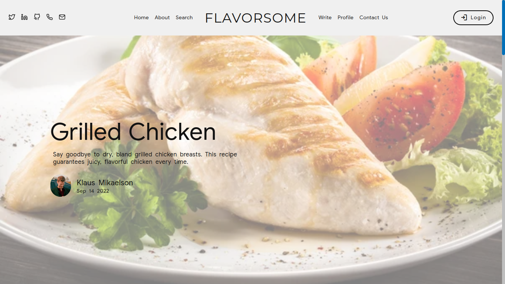

# FlavorSome

Never miss out on any new food and dishes idea. Share your own reciepies and read others' with FlavorSome.



# Introduction

FlavorSome allows you to view various delicious recipes shared by the users and gives you the privilege to share your recipe too!

Grab this opportunity now and show the world how amazing your recipes are!

Search for what you want to cook and Hurray! Impress others with mouth-watering viands.

-   **Runtime used for whole application** - [Node.js](https://nodejs.org/)
-   **Frontend framework** - [React JS](https://reactjs.org/)
-   **CSS preprocessor** - [SASS](https://sass-lang.com/)
-   **Backend framework** - [Express](https://expressjs.com/)
-   **Database** - [MongoDB](https://www.mongodb.com/)

# Development

To clone copy the following command in your terminal and start development.

```sh
git clone https://github.com/srijan-99/flavorsome.git
```

cd into the directory

```sh
cd flavorsome
```

Install all the dependencies
```sh
npm i
```

Run the project in development mode

```sh
npm run react
```

Run the backend server

```sh
npm run server
```
This will run the server on port [$PORT](http://localhost:5000) locally with nodemon to continuously watch every change.

If you don't have nodemon on your system, run
```sh
npm i nodemon -g
```

Open [http://localhost:3000](http://localhost:3000) to view it in the browser.

## Environment Variables:
Building the .env
- **MONGO_CONNECTION_URL:** Create a database in MongoDB cluster and paste the connection string in here

- **PORT:** Assign a PORT to run teh backend server (usually `4000` or `5000`)
- **JWT_SECRET:** Assign a string for the JWT web token or request the [developers](#author) to provide you with the official one.
- **REACT_APP_BACKEND_URL:** Create the backend URL for which React App will send the server requests to.

# Author

- [Srijan Ojha](https://github.com/srijan-99/)
